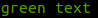

# J@m; Console

..

## Installation

To install Jm_Console you can use the PEAR installer or get a tarball and install the files manually.

___
### Using the PEAR installer

If you haven't discovered the metashock pear channel yet you'll have to do it. Also you should issue a channel update:

    pear channel-discover metashock.de/pear
    pear channel-update metashock

After this you can install Jm_Console. The following command will install the lastest stable version with its dependencies:

    pear install -a metashock/Jm_Console

If you want to install a specific version or a beta version you'll have to specify this version on the command line. For example:

    pear install -a metashock/Jm_Console-0.3.0

___
### Manually download and install files

Alternatively, you can just download the package from http://www.metashock.de/pear and put into a folder listed in your include_path. Please refer to the php.net documentation of the include_path directive.


## Usage

___
### Basics

Before accessing Jm_Console's functions you'll first get an object reference to it. Jm_Console is a singleton class meaning there is just a single reference available. To get the reference call:

```php

// require Jm_Autoloader
require_once 'Jm/Autoloader.php';

// get an instance of Jm_Console
$console = Jm_Console::singleton();
```
___
### Printing output 

Jm_Console provides write access to STDOUT and STDERR. Output is done using the following functions:

```php
$console->write('foo');    // writes foo to stdout
$console->writeln('foo');  // writes foo to stdout and adds a newline

$console->error('foo');    // writes foo to stderr
$console->errorln('foo');  // writes foo to stderr and adds a newline
```

___
### Terminal colors

Jm_Console aims to provide an intuitive access to terminal colors when printing text.



### API documentation

The API docs can be found here:

    http://metashock.de/docs/api/Jm/Console/index.html


